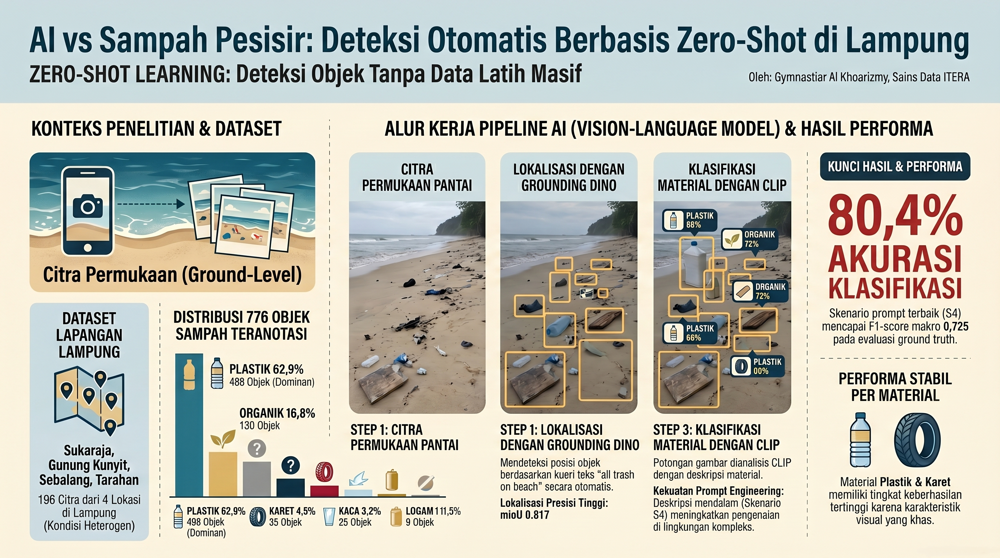
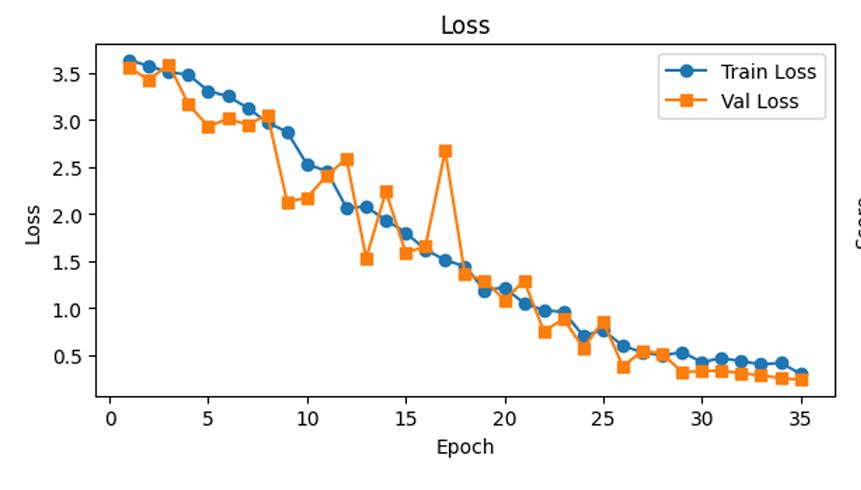
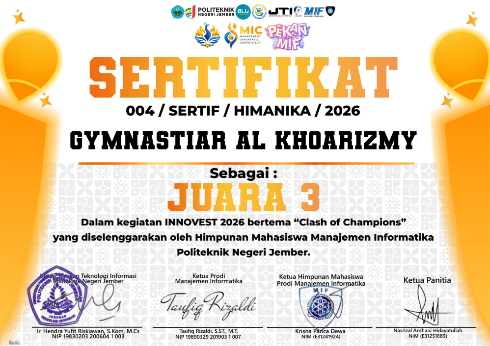
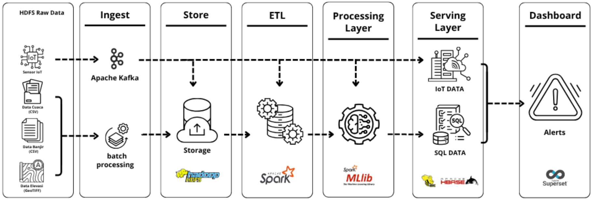

# Portfolio

Hi, I am **Gymnastiar Al Khoarizmy**, a Data Science undergraduate student at Institut Teknologi Sumatera.
I am interested in machine learning, deep learning, MLOps, AI data quality, computer vision, speech understanding, and big data analytics.

---

## Featured Projects

### [Zero-Shot Coastal Waste Detection and Material Classification](coastal_waste_detection.md)

Exploring zero-shot vision-language models (Grounding DINO + CLIP) for detecting and classifying coastal waste materials. Details will be added after thesis submission/publication.

---

### [End-to-End Spoken Language Understanding for Retail Transaction Recording](slu_retail.md)

Developed an end-to-end Indonesian SLU system using CNN–BiLSTM multi-task learning to extract product, quantity, and intent directly from speech — achieving macro-F1 up to **0.98**.

---

### [Plant Disease Diagnosis System using MLOps and Active Learning](plant_disease_mlops.md)

Developed a machine learning-based plant disease diagnosis system concept using MLOps and active learning. Awarded **3rd Winner at INNOVEST 2026 "Clash of Champions"**.

---

### [Predictive Flood Analytics with Hadoop Ecosystem in Lampung](flood_analytics.md)

Built a big data analytics workflow using the Hadoop ecosystem to support flood-related predictive analytics in Lampung.

---

## Research / Publication

### [Seasonal Forecasting of Ferry Passenger Demand](ferry_passenger_forecasting.md)

Time series forecasting research on ferry passenger demand at Bakauheni Port, Indonesia. Published in the **International Journal of Electronics and Communications System (IJECS)**.

---

## Links

* [GitHub](https://github.com/alkhrzmy)
* [LinkedIn](https://www.linkedin.com/in/gymnastiar-al-khoarizmy)
* [Resume](pdf/CV%20Gymnastiar%20Al%20Khoarizmy%20020626.pdf)