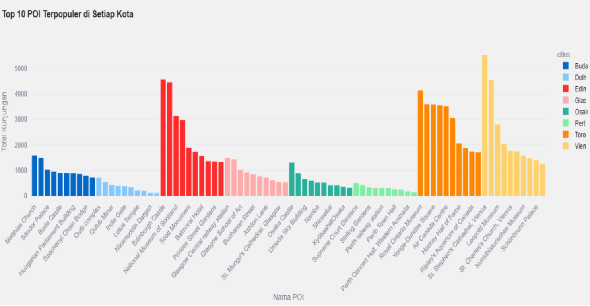
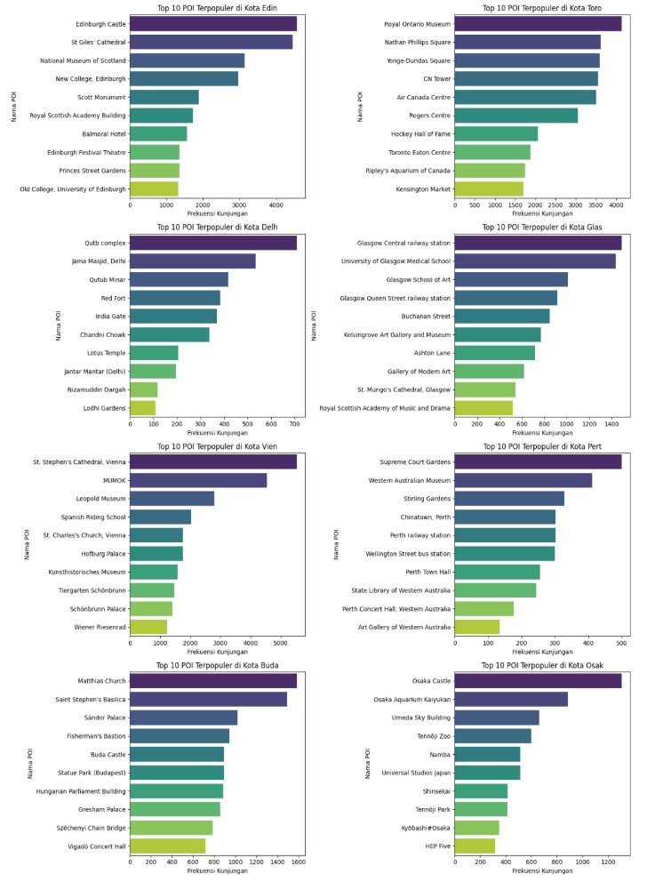
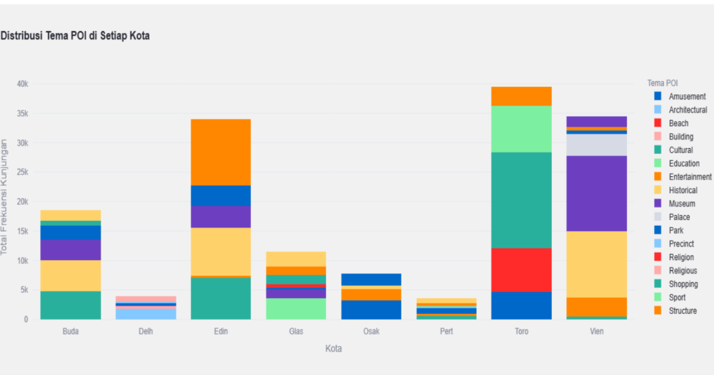
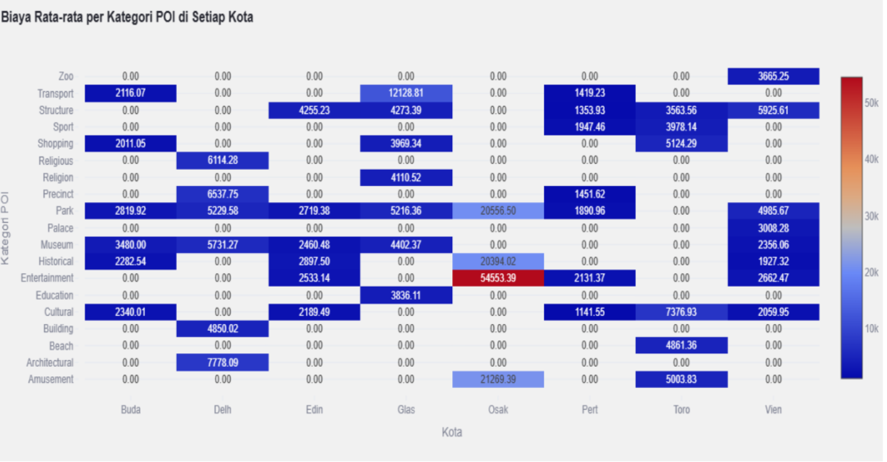
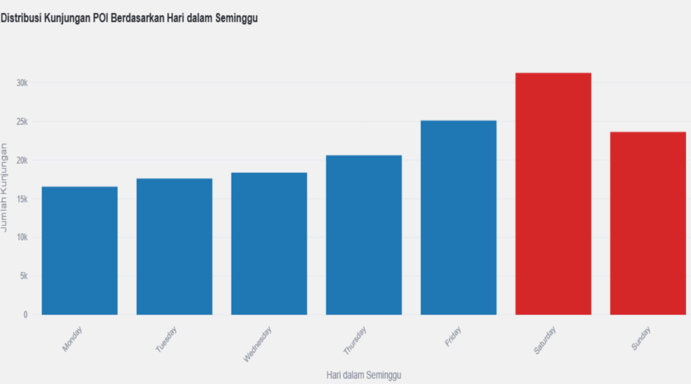
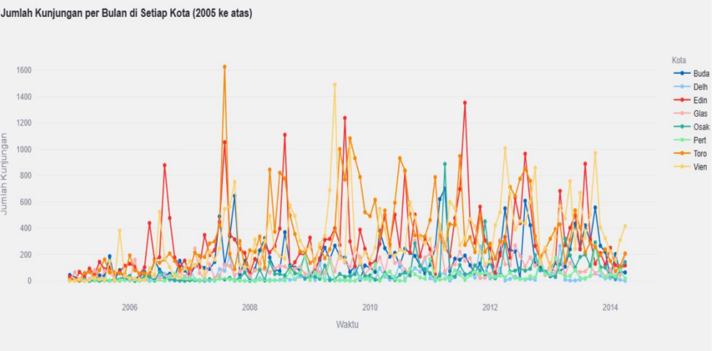
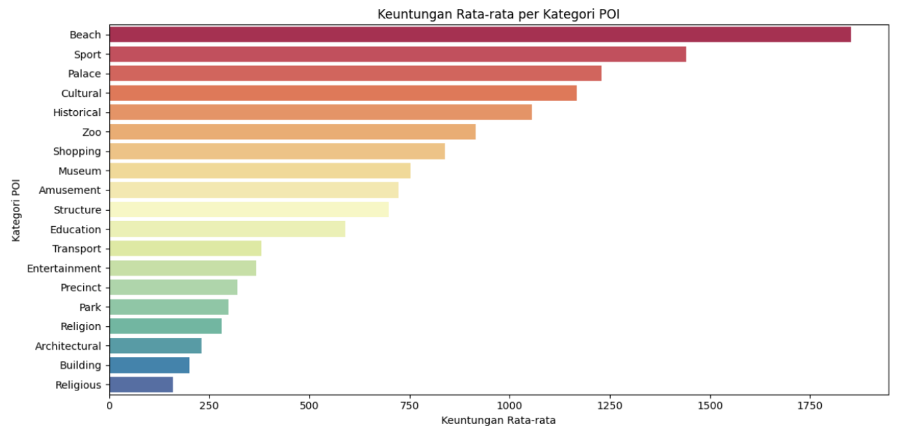

# Tourist Visit Analysis to Points-of-Interest in 8 Cities

## Live Demo

[**Open Streamlit Dashboard →**](https://poi-visualization-vdi-team-15.streamlit.app/)

---

This project analyzes and visualizes tourist visit patterns to **Points-of-Interest (POI)** across **8 cities** — Budapest, Delhi, Edinburgh, Glasgow, Osaka, Perth, Toronto, and Vienna — using the **Flickr YFCC100M dataset**.

The goal is to understand tourist behavior, visit frequency, POI theme distributions, cost patterns, and temporal trends through interactive data visualization built with Python (Pandas, Matplotlib, Seaborn, Plotly) and deployed as a Streamlit dashboard.

---

## Dataset

<cite index="4-8,4-9,4-10">The dataset contains user-POI interaction records capturing user behavior and travel patterns across eight cities by analyzing their visits to various points of interest. The data source is the Flickr YFCC100M dataset.</cite>

| Column | Description |
|---|---|
| poiID | Unique ID for each Point of Interest |
| poiName | Name of the location |
| lat / long | Geospatial coordinates |
| theme | POI category/theme |
| userID | Unique user identifier |
| dateTaken | Photo timestamp (Unix time) |
| poiTheme | POI visit theme (e.g., Architectural, Religious) |
| poiFreq | Visit frequency count |
| cost / profit | Travel cost and profit value for each route |

---

## Analysis Questions

This project answers 9 key visualization questions:

1. Which POI is most popular in each city by visit frequency?
2. Which POI is most visited in a specific city?
3. How is the POI theme distributed across each city?
4. What is the average cost distribution per POI category per city?
5. How do tourist visits differ between weekdays and weekends?
6. How are visit distributions across POI themes between weekday and weekend?
7. What are the POI visit trends over time across cities?
8. What is the average profit per POI category?
9. How are POI themes distributed in a selected city (with map)?

---

## Data Preprocessing

**Data Merging:** Combined `userVisits` and `poiList` tables on `poiID` and `cities`.

**Data Cleaning:**
- Removed underscores from `poiName` and decoded URL encoding
- Removed outliers from `cost` column using IQR method (Q1 − 1.5×IQR, Q3 + 1.5×IQR)

**Transformation:**
- Added `Year_Month` column from `dateTaken` timestamps
- Added `is_weekend` flag (Saturday = 5, Sunday = 6)
- Grouped and aggregated visit counts per city and POI

---

## Visualizations & Findings

### 1. Top 10 Most Popular POI Across All Cities

<cite index="4-86,4-87">Each city has a standout POI that serves as the main attraction for tourists. POIs like Schönbrunn Palace in Vienna, Qutub Minar in Delhi, and Scott Monument in Edinburgh show dominant visitor numbers.</cite>

---

### 2. Top 10 POI per Individual City

Key highlights per city:
- <cite index="4-93,4-94">**Edinburgh:** Edinburgh Castle is the most visited POI, followed by St Giles' Cathedral and National Museum of Scotland — showing that Scottish history and culture are the main draw.</cite>
- <cite index="4-95,4-96">**Delhi:** Qutb Complex is the most popular, followed by Jama Masjid and Qutb Minar, reflecting tourist interest in Islamic history and architecture.</cite>
- <cite index="4-107,4-108">**Osaka:** Osaka Aquarium Kaiyukan is the most popular, followed by Umeda Sky Building and Universal Studios Japan, reflecting interest in marine life and entertainment.</cite>

---

### 3. POI Theme Distribution per City

<cite index="4-117,4-118">Budapest is dominated by Cultural and Historical themes, indicating the city has many historical sites, museums, and heritage buildings that attract visitors.</cite> <cite index="4-121,4-122">Edinburgh shows a very dominant Cultural theme, reinforcing its reputation for rich cultural heritage and art-related attractions.</cite> <cite index="4-129,4-130">Toronto shows a strong combination of Sport and Amusement themes, indicating many sports facilities and entertainment venues.</cite>

---

### 4. Average Cost per POI Category per City (Heatmap)

<cite index="4-138,4-139">Glasgow shows the highest average cost overall, especially in Entertainment and Structure categories, indicating that enjoying entertainment and visiting certain buildings in Glasgow tends to be more expensive than other cities.</cite> <cite index="4-153,4-154,4-155">Overall, average costs per POI category vary greatly across cities. Cities like Glasgow, Osaka, Delhi, Budapest, and Vienna tend to have higher average costs, especially in Entertainment, Historical, Museum, and Park categories — potentially due to destination popularity, high operational costs, or different pricing policies.</cite>

---

### 5. Weekday vs Weekend Visit Distribution

<cite index="4-163,4-164,4-165">During weekdays, visit counts are relatively stable from Monday to Thursday, with a significant increase on Friday — suggesting tourists become more active heading into the weekend.</cite> <cite index="4-167,4-168">On weekends, there is a significant surge in visits, with Saturday being the peak day of the week. This suggests tourists prefer Saturday for recreational activities as they still have Sunday to follow.</cite>

---

### 6. POI Theme Distribution: Weekday vs Weekend

<cite index="4-179,4-180,4-181">POI themes like Amusement, Beach, Park, and Zoo show higher weekend visit dominance. Entertainment venues become favorite destinations for families and individuals seeking recreation during free time.</cite> <cite index="4-186,4-187,4-188">POIs with Transport and Education themes tend to be visited more on weekdays — transport hubs are busier during daily commuting, while educational POIs like museums often receive school and university group visits during working days.</cite>

---

### 7. POI Visit Trends Over Time

<cite index="4-208,4-209">POI visit trends vary greatly across cities and are influenced by various factors. A deeper analysis would need to consider seasonality, special events, and economic conditions.</cite>

---

### 8. Average Profit per POI Category

Top profit categories:
- <cite index="4-215,4-216">**Beach** has the highest profit potential, followed by **Sport** — showing that beaches and sports/fitness facilities generate strong revenue.</cite>
- <cite index="4-217,4-218">**Palace** (historical sites and forts) also shows good profit, likely due to their historical value and architectural appeal. **Cultural** venues like museums, art galleries, and cultural centers also have significant profit potential.</cite>

---

### 9. POI Location Map and Theme Distribution per City

Selected city examples:
- **Toronto** — Dominated by Cultural (27.9%), Sport (19.9%), Beach (18.8%)
- **Vienna** — Museum-heavy (37.1%) with strong Historical presence (22.5%)
- **Budapest** — Balanced Historical (28.8%) and Cultural (25.6%)
- **Osaka** — Entertainment-focused: Amusement (41.6%) + Entertainment (24.7%)
- **Edinburgh** — Structure (32.9%) and Historical (24%) dominate

---

## Key Learnings

Through this project, I learned how to:
- Build an end-to-end data visualization pipeline with multi-table relational data
- Clean and preprocess geospatial and temporal data (IQR outlier removal, URL decoding, timestamp parsing)
- Design multiple chart types — bar, stacked bar, heatmap, line chart, pie chart, and interactive maps
- Use Plotly for interactive geospatial visualizations (Scattermapbox + pie chart subplots)
- Deploy an interactive analytics dashboard with Streamlit
- Extract actionable insights from tourist behavior data

---

## Tech Stack

- **Python** — Core analysis
- **Pandas** — Data processing and aggregation
- **Matplotlib / Seaborn** — Static visualizations
- **Plotly / Plotly Express** — Interactive charts and maps
- **Streamlit** — Dashboard deployment
- **Flickr YFCC100M** — Dataset source

---

## Team

- **Gymnastiar Al Khoarizmy** (Lead) — Code writing, data cleaning, outlier removal, transformations, all visualizations
- **Dea Mutia Risani** — Report writing, analysis narration, insight extraction, visualization quality review

---

## Repository

GitHub repository link will be added here.

---

## Live Demo

[**Open Streamlit Dashboard →**](https://poi-visualization-vdi-team-15.streamlit.app/)
