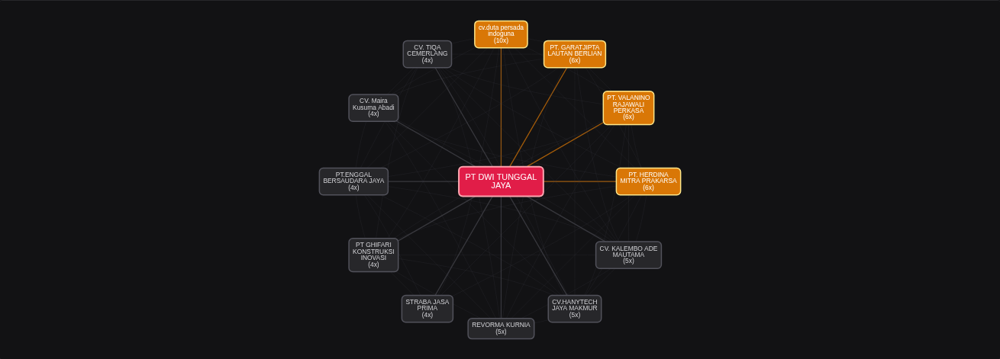
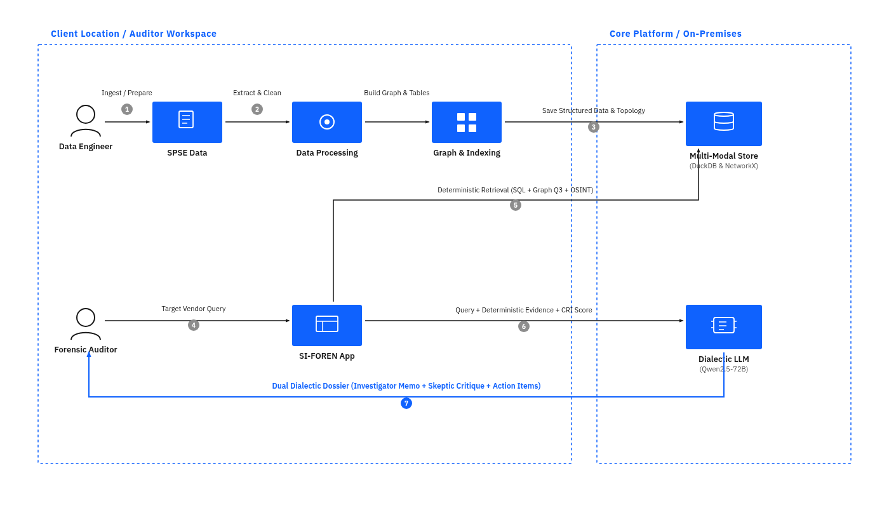

# SI-FOREN: Indonesian Public Procurement Intelligence Platform

## Overview

**SI-FOREN** is a procurement intelligence platform designed to uncover competition dynamics, vendor networks, and market concentration patterns across Indonesian government tender data (SPSE / LPSE).

Most public procurement dashboards stop at aggregate spending summaries. SI-FOREN analyzes micro-level bidding behavior: who competes against whom, which vendors form persistent co-bidding clusters, and how pricing pressure behaves once passive, non-submitting participants are filtered out.

- **Live Application:** [Hugging Face Spaces → alkhrzmy/si-foren](https://huggingface.co/spaces/alkhrzmy/si-foren)
- **Source Repository:** [GitHub → alkhrzmy/si-foren](https://github.com/alkhrzmy/si-foren)
- **Public BI Dashboard:** [Tableau Public → DashboardSPSETableau](https://public.tableau.com/app/profile/gymnastiar.al.khoarizmy/viz/DashboardSPSETableau/Dashboard1)

---

## The Engineering Problem

Public tender platforms list thousands of registered participants, but up to **80%** are passive observers who never submit price bids. Traditional aggregation treats all registrants equally, creating false competition metrics.

Key challenges addressed:
- Ingesting and normalizing **36,135** historical tender records across Indonesian ministries and local governments with an aggregate HPS value of **Rp 249+ Trillion**.
- Isolating actual price-submitting bidders from passive registrants to expose true competition ratios.
- Mapping high-order vendor relationships across hundreds of agencies to detect persistent bidding clusters and potential cover-bidding anomalies.
- Serving sub-second analytical queries on resource-constrained hosting (free-tier infrastructure).

---

## System Architecture

SI-FOREN follows a decoupled, deterministic-first architecture:

1. **High-Performance Analytics (Local & Deterministic):**
   - **DuckDB:** In-process columnar OLAP database executing multi-table aggregations, agency portfolio filters, and pricing pressure distributions in sub-30ms.
   - **NetworkX:** Computes a co-bidding network graph comprising **1,909** vendor nodes and **17,965** co-bidding edges, with Louvain community detection yielding modularity $Q = 0.670$.

2. **Narrative Synthesis (Cloud Serverless LLM):**
   - **Qwen2.5-72B-Instruct** (via Hugging Face Serverless API): Generates plain-language investigative summaries and structural insights from deterministic data scorecards, ensuring factual grounding without hallucination.

3. **Interactive Frontend:**
   - Deployed on **Hugging Face Spaces (ZeroGPU)** using a minimalist, dark-themed **Gradio** interface optimized for exploratory data analysis.

---

## Key Impact & Metrics

- **Dataset Scope:** 36,135 public tender records evaluated.
- **Graph Modeling:** 1,909 vendor nodes, 17,965 co-bidding edges, 13 distinct communities detected ($Q = 0.670$).
- **Query Performance:** Sub-30ms retrieval latency powered by DuckDB columnar indexing.
- **Explainability:** Zero black-box scoring — all indicators are grounded in verifiable open tender records.
