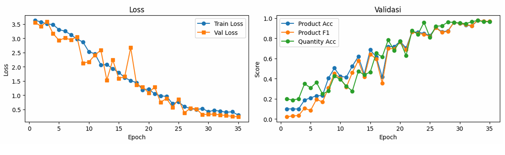
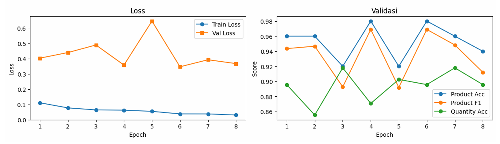

# End-to-End Spoken Language Understanding for Retail Transaction Recording

## Overview

This project develops an **End-to-End Spoken Language Understanding (SLU)** system for Indonesian retail transaction recording using a **CNN–BiLSTM multi-task learning** architecture.

The system directly extracts semantic transaction information — **product**, **quantity**, and **intent** — from raw speech signals, without relying on a separate speech-to-text transcription step. This eliminates error propagation common in conventional pipeline architectures (ASR → NLU) and makes it more efficient for real-world cashier use.

Published in the **Journal of Science and Applicative Technology (JSAT)**, Institut Teknologi Sumatera.

---

## Problem

Manual or text-based transaction recording in Indonesian SMEs (UMKM) is slow, error-prone, and interrupts cashier workflow. A voice-based system can provide a more natural and ergonomic interface — allowing transaction input through speech without requiring intensive screen interaction.

Key challenges in the Indonesian context:
- Most SLU research focuses on English and other high-resource languages
- Indonesian retail speech domain is unexplored and lacks public datasets
- Pipeline approaches (ASR + NLU) have high error propagation risk

---

## Objective

Build an end-to-end deep learning model that:
- Understands Indonesian retail speech directly from audio
- Simultaneously predicts product class, quantity, and transaction intent
- Generalizes well to natural human speech, not just synthetic data

---

## Dataset

A **hybrid dataset** combining synthetic and manually recorded speech was created specifically for this project:

| Type | Count | Source |
|---|---|---|
| Synthetic speech | 550 samples | Google Text-to-Speech (TTS) |
| Manual recordings | 450 samples | Human speakers |
| **Total** | **1,000 samples** | — |

Each audio sample is annotated with three semantic labels:
- **Product** — type of retail item
- **Quantity** — number of items
- **Intent** — transaction intent (e.g., buy, cancel)

**Audio preprocessing:**
- Resampled to 16,000 Hz, mono channel
- Silence trimming at 30 dB threshold
- Split into train / validation / test sets

---

## Feature Extraction

Raw audio is converted into **Log-Mel Spectrogram** representations as input to the neural network:

- FFT window size: 1024
- Hop length: 256
- Mel filter banks: 128 channels
- Normalization: power-to-dB scaling

**Data Augmentation** (applied stochastically during training):
- SpecAugment: frequency masking (width 18) + time masking (width 24)
- Gaussian noise injection (std = 0.05)
- Time shifting

---

## Model Architecture

The model uses a **CNN–BiLSTM Multi-Task Learning** architecture:

```
Log-Mel Spectrogram Input
        ↓
[CNN Encoder] — 3 ConvBlocks
  Conv2D → BatchNorm → ReLU → MaxPool → Dropout(0.2)
        ↓
[BiLSTM Layer]
  Captures bidirectional temporal dependencies
        ↓
  ┌─────────────┬──────────────┬──────────────┐
  ↓             ↓              ↓
[Product Head] [Quantity Head] [Intent Head]
  Linear → LayerNorm → Dropout(0.3)
```

Three separate classification heads share the same encoder, enabling joint learning across all prediction tasks in a single forward pass.

---

## Training Strategy

A **Two-Stage Training** approach was used to handle the imbalance between synthetic and manual data:

**Stage 1 — Mixed Training:**
- All 1,000 samples (synthetic + manual)
- Weighted Random Sampler to oversample manual data (weight = 5)
- Prevents model bias toward synthetic speech patterns
- Best config: Batch Size 8, LR 0.0001, Weight 5 → Macro F1 = **0.9609**

**Stage 2 — Fine-Tuning:**
- Manual recordings only (450 samples)
- Reduced learning rate (LR = 0.00005) for stable domain adaptation
- Augmentation disabled to preserve natural speech characteristics
- Best result: Macro F1 = **0.9798** at epoch 6

The fine-tuning stage improved generalization to real-world speech conditions while maintaining high accuracy.

---

## Results



*Stage-1 training curve: loss convergence (left) and validation accuracy per task — Product Acc, Product F1, Quantity Acc (right)*

### Stage 1 — Mixed Training Performance
| Metric | Value |
|---|---|
| Macro F1 Score (Product) | **0.9788** |
| Balanced Accuracy (Product) | > 0.96 |
| Balanced Accuracy (Quantity) | > 0.95 |



*Stage-2 fine-tuning curve on manual recordings only — LR 0.00005, best Macro F1 = 0.9798 at epoch 6*

### Stage 2 — Fine-Tuning Performance
| Metric | Value |
|---|---|
| Macro F1 Score (best) | **0.9798** |
| Balanced Accuracy (Product) | > 0.94 |
| Balanced Accuracy (Quantity) | 0.89 – 0.92 |

The slight drop in quantity accuracy after fine-tuning is expected due to the smaller dataset size — consistent with findings that synthetic pre-training improves robustness while fine-tuning improves domain fit.

---

## Key Learnings

Through this project, I learned how to:
- Build an end-to-end speech understanding pipeline without ASR dependency
- Process audio into Log-Mel Spectrogram features with Librosa
- Design a CNN–BiLSTM multi-task architecture in PyTorch
- Apply Two-Stage Training to bridge synthetic and real-world data
- Handle class imbalance with Weighted Random Sampler
- Tune hyperparameters (batch size, LR, weight) via grid search
- Evaluate multi-label classification with macro-F1 and balanced accuracy

---

## Tech Stack

- **Python** — Core implementation
- **PyTorch** — Model training and architecture
- **Librosa** — Audio feature extraction (Log-Mel Spectrogram)
- **CNN–BiLSTM** — Model architecture
- **Multi-Task Learning** — Joint prediction of product, quantity, intent
- **SpecAugment** — Audio augmentation
- **AdamW** — Optimizer with weight decay regularization
- **NumPy / Pandas / Scikit-learn** — Data processing and evaluation
- **Matplotlib** — Training visualization

---

## Repository

[View GitHub Repository](https://github.com/alkhrzmy/SLU-Ritel-CNNBiLSTM)

---

## Project Status

Developed as a deep learning course project at Institut Teknologi Sumatera. The paper has been submitted to the **Journal of Science and Applicative Technology (JSAT), ITERA** (e-ISSN: 2581-0545).

Future improvements may include:
- Expanding the dataset with more diverse speakers and dialects
- Adding attention mechanisms to the BiLSTM layer
- Deploying as a lightweight mobile or embedded application for SME cashiers
